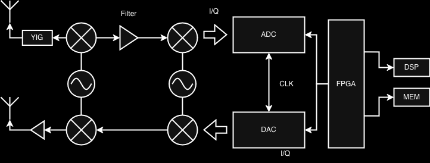

# DRFM

**Work in progress!**

## What?

Digital Radio Frequency Memory (DRFM) with Reinforcement Learning (RL). The goal
of this project is to implement a DRFM with RL agents in the midst of an
electromagnetic environment. The goal is to have some form of moving object
(drone or not) that can maneuver terrain and given RADAR jammers located at some
position its aim is to use its self-protection DRFM module to continue normal
operations and achieve its goal.

The assumption is there will other 'players' or agents in the environment that
aim to destroy the moving object. Another assumption is the usage of the Radio
Frequency (RF) environment for task completion.

Note this idea is not completely fleshed out; ideally I build something in real
life alongside the simulation results otherwise working only with simulations
will get boring quick. Isaac sim will be used for robotics for early simulation,
the foundation environment may change depending on how difficult it is to embed
RF components into the environment to maybe something like
[Sionna](https://developer.nvidia.com/sionna).

--------

## DRFM Module



## Setup

Make sure Isaac Sim and Lab are [installed](https://isaac-sim.github.io/IsaacLab/main/source/setup/installation/binaries_installation.html#verifying-the-isaac-lab-installation) & environment is setup properly:
```
conda env create -f environment.yaml -n [name]
conda activate [name]
export ISAACSIM_PATH="${HOME}/isaacsim/_build/linux-x86_64/release"
export ISAACSIM_PYTHON_EXE="${HOME}/isaacsim/_build/linux-x86_64/release/python.sh"
ln -s ${ISAACSIM_PATH} _isaac_sim
```

<video width="600" autoplay loop muted>
  <source src="media/start.webm" type="video/webm">
</video>

--------

## Project Organization

```
├── LICENSE
├── meta.md
├── README.md
├── data
│   ├── external
│   ├── interim
│   ├── processed
│   └── raw
|
├── docs
├── media
├── models
├── reports
│   ├── figures
│   └── Media
|
├── environment.yaml
└── drfm
    ├── __init__.py
    ├── main.py
    ├── agent.py
    ├── discrete.py
    └── libs
        ├── libmdp.py
        └── libsparse.py
```

--------

# Citations
+ Claude for programming
+ Kaufmann, Elia, et al. "Champion-level drone racing using deep reinforcement learning." Nature 620.7976 (2023): 982-987.
+ Reinforcement Learning Richard S. Sutton, Andrew G. Barto 2018
+ Project structure used in repository [Cookiecutter](https://cookiecutter-data-science.drivendata.org)
+ DRFM circuit figure \& general information [DRFM history, circuit & testing](https://www.rohde-schwarz.taipei/data/activity/file/1644474835378405224.pdf)
+ Cognitive radio/RF basics [NATO Cognitive Radio Technical Report](https://www.sic.rma.ac.be/~vlenir/publications/STO-TR-IST-077.pdf)
+ Some DRFM mathematics [DRFM-Modulator For HRR-Jamming](https://web.archive.org/web/20110722014927/http://ftp.rta.nato.int/public//PubFullText/RTO/MP/RTO-MP-SET-080///MP-SET-080-P07.pdf)
+ Bellman equations used for libmdp [Bellman eq](https://en.wikipedia.org/wiki/Bellman_equation#The_Bellman_equation)
+ Optimality used for libmdp [Bellman optimality](https://en.wikipedia.org/wiki/Bellman_equation#Bellman's_principle_of_optimality)
+ [Markov algorithms (value, policy iteration)](https://en.wikipedia.org/wiki/Markov_decision_process#Algorithms)
+ Foundation model used [Isaac Sim: Foundation](https://github.com/isaac-sim/IsaacSim)
+ RL environments [Isaac Lab: Environment](https://isaac-sim.github.io/IsaacLab/main/source/setup/installation/binaries_installation.html)
