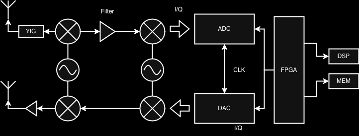
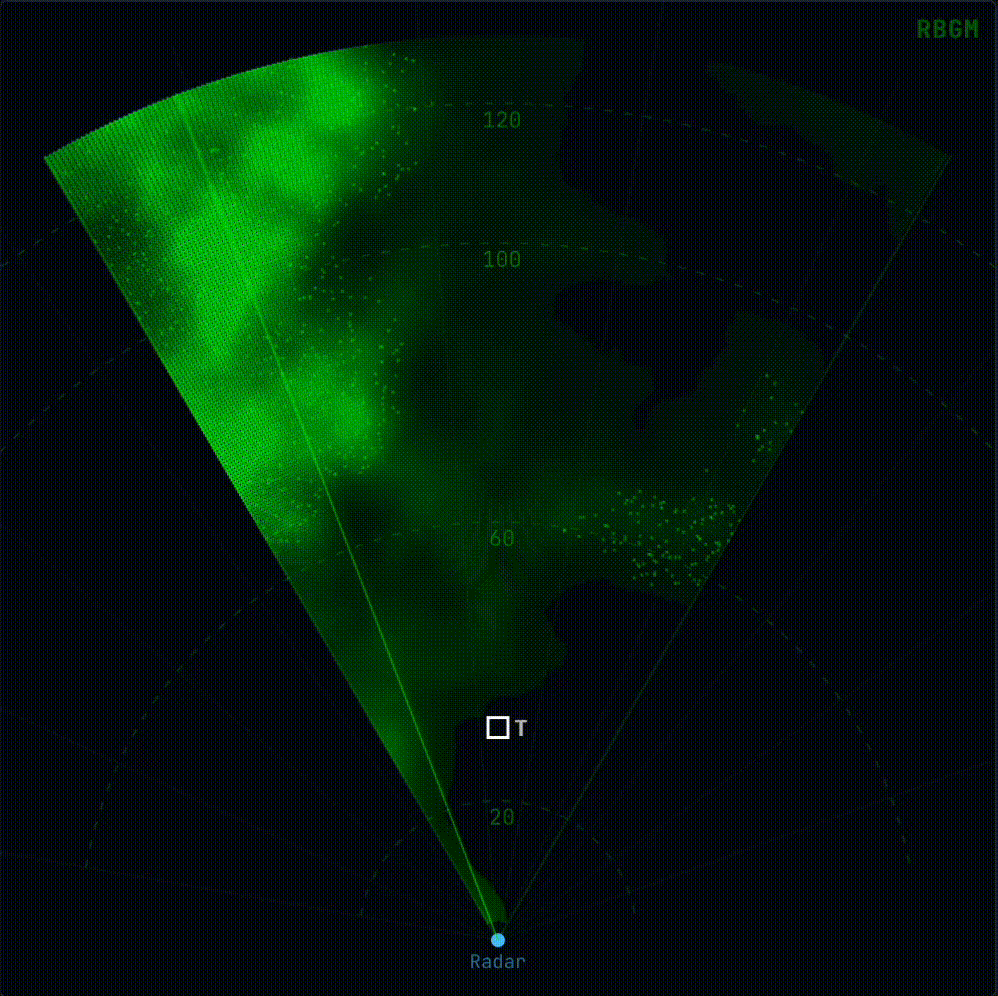
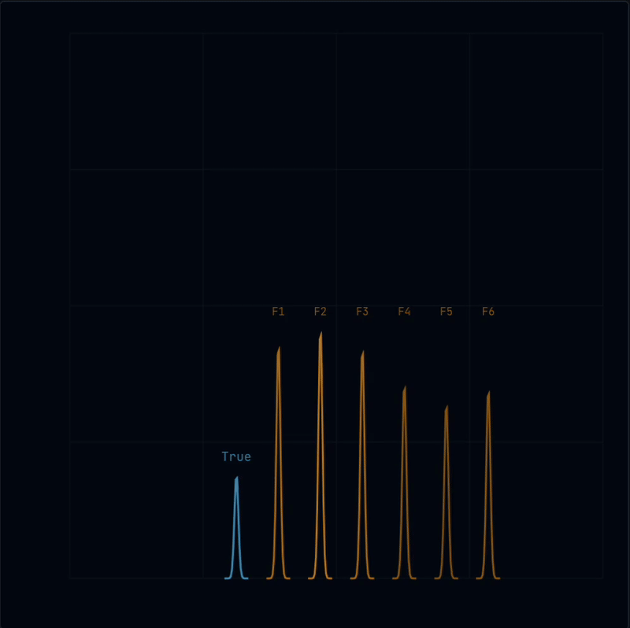
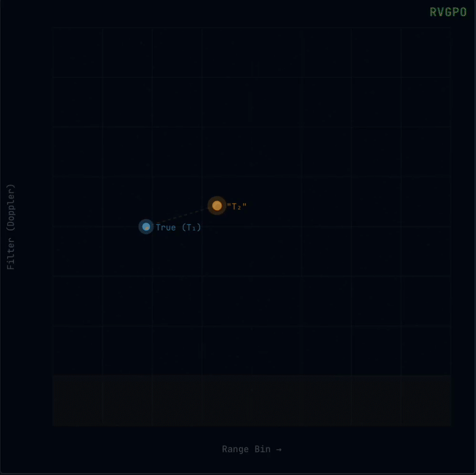
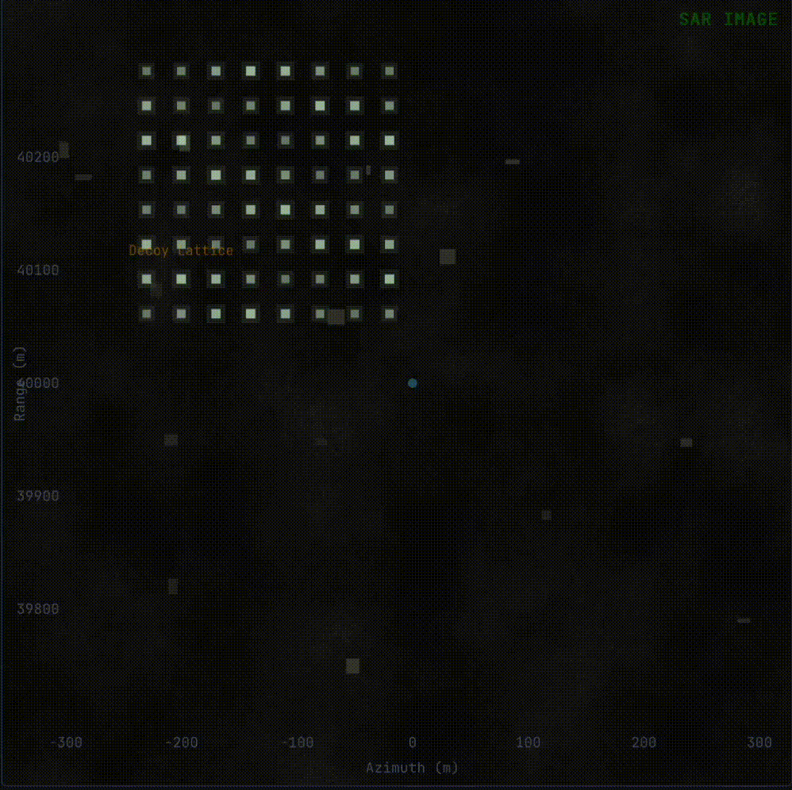

# Reinforcement Learning & DRFM

<table align="center">
    <tr>
        <td>
            
        </td>
        <td>
            
        </td>
    </tr>
</table>

This project aims to create a realistic Digital Radio Frequency Memory module
embedded on a drone that operates using Reinforcement Learning algorithms, the
drone itself also maneuvers using an algorithm tasked with surviving Radar
tracking. Maneuverability is based on [4] which is based off the research paper
[1]. Drone is used to survive some electromagnetic environment with
deterministic radars that attempt to gain a lock, the DRFM module is trained to
survive using realistic jamming techniques: transponder and repeater false
targeting, combination of RGPO and VGPO, and SAR active decoy.

## DRFM Action Space

<table align="center">
    <tr>
        <td>
            <br>
            Transponder
        </td>
        <td>
            <br>
            Repeater
        </td>
        <td>
            <br>
            RGPO
        </td>
    </tr>
    <tr>
        <td>
            <br>
            VGPO
        </td>
        <td>
            <br>
            Coordinated
        </td>
        <td>
            <br>
            SAR Decoy
        </td>
    </tr>
</table>

## Setup

Make sure Isaac Sim and Lab are [installed](https://isaac-sim.github.io/IsaacLab/main/source/setup/installation/binaries_installation.html#verifying-the-isaac-lab-installation) & environment is setup properly:
```
conda env create -f environment.yaml -n [name]
conda activate [name]
export ISAACSIM_PATH="${HOME}/isaacsim/_build/linux-x86_64/release"
export ISAACSIM_PYTHON_EXE="${HOME}/isaacsim/_build/linux-x86_64/release/python.sh"
ln -s ${ISAACSIM_PATH} _isaac_sim
```

## Project Organization

```
├── LICENSE
├── README.md
├── pyproject.toml
│
├── configs/
├── docs/
├── media/ 
├── examples/
├── scripts/
│   ├── train.py
│   └── play.py
│
├── drfm/
│   ├── __init__.py
│   ├── assets/
│   ├── robots/
│   ├── envs/
│   │   ├── isaac/
│   │   │   └── mdp/
│   │   └── gym/
│   ├── agents/
│   ├── algorithms/
│   ├── dynamics/
│   └── utils/
```

## References

[1] Kaufmann, E., et al. "Champion-level drone racing using deep reinforcement learning." *Nature* 620.7976 (2023): 982–987.
[2] Sutton, R. S., & Barto, A. G. *Reinforcement Learning: An Introduction.* MIT Press, 2018.
[3] Merrick, R. *Getting Started with FPGAs: Digital Circuit Design, Verilog, and VHDL for Beginners.* No Starch Press, 2023.
[4] Pace, P. E. *Developing Digital RF Memories and Transceiver Technologies for Electromagnetic Warfare.* Artech House, 2022.
[5] [Isaac Drone Racer](https://github.com/kousheekc/isaac_drone_racer)
[6] [Isaac Sim: Foundation Model](https://github.com/isaac-sim/IsaacSim)
[7] [Isaac Lab: RL Environments](https://isaac-sim.github.io/IsaacLab/main/source/setup/installation/binaries_installation.html)
[8] [Radar Equations - MIT Lincoln Lab](https://www.ll.mit.edu/sites/default/files/outreach/doc/2018-07/lecture%202.pdf)
[9] [Radar Jamming and Deception - Wikipedia](https://en.wikipedia.org/wiki/Radar_jamming_and_deception)
[10] [DRFM: History, Circuit & Testing - Rohde & Schwarz](https://www.rohde-schwarz.taipei/data/activity/file/1644474835378405224.pdf)
[11] [TD Learning - Stanford CME241](https://web.stanford.edu/class/cme241/lecture_slides/rich_sutton_slides/11-12-TD.pdf)
[12] [Bellman Equation - Wikipedia](https://en.wikipedia.org/wiki/Bellman_equation#The_Bellman_equation)
[13] [Bellman's Principle of Optimality - Wikipedia](https://en.wikipedia.org/wiki/Bellman_equation#Bellman's_principle_of_optimality)
[14] [MDP Algorithms: Value & Policy Iteration - Wikipedia](https://en.wikipedia.org/wiki/Markov_decision_process#Algorithms)
[16] [AN/ALE-55 Fiber-Optic Towed Decoy (FOTD) Image - BAE SYSTEMS](https://www.baesystems.com/en-us/product/anale55-fiberoptic-towed-decoy)
[15] Claude (Anthropic)
