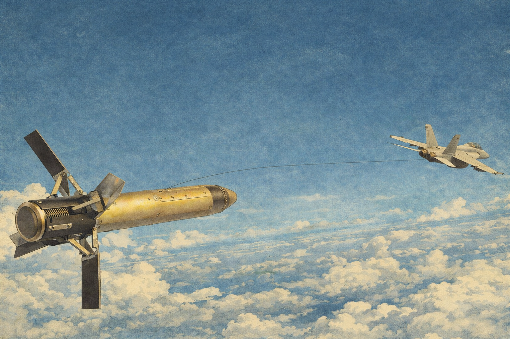
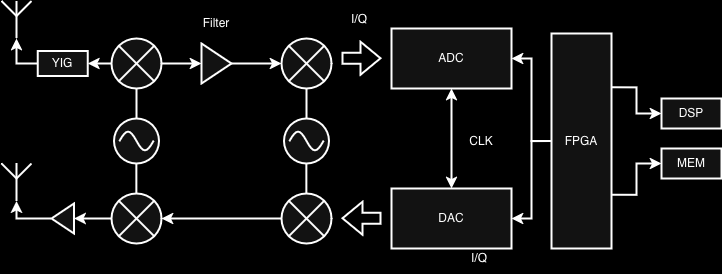
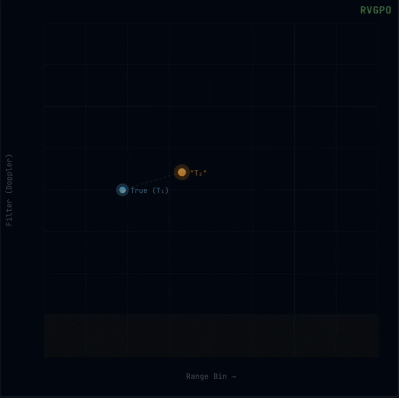

# Reinforcement Learning & DRFM

<table align="center">
    <tr>
        <td>
            
        </td>
        <td>
            
        </td>
    </tr>
</table>

This project aims to create a realistic Digital Radio Frequency Memory module
embedded on a drone that operates using Reinforcement Learning algorithms, the
drone itself also maneuvers using an algorithm tasked with surviving Radar
tracking. Maneuverability is based on [4] which is based off the research paper
[1]. Drone is used to survive some electromagnetic environment with
deterministic radars that attempt to gain a lock, the DRFM module is trained to
survive using realistic jamming techniques: transponder and repeater false
targeting, combination of RGPO and VGPO, and SAR active decoy.

## Foundations

We highly recommend readers to go through `docs/` directory for quickly catching up to speed with how foundational things are implemented in this project or building a mental mindmap on where inspiration came from.

<table align="center">
    <tr>
        <td>
            <br>
            RGPO
        </td>
        <td>
            <br>
            VGPO
        </td>
        <td>
            <br>
            Coordinated
        </td>
    </tr>
</table>

## Usage

<table align="center">
    <tr>
        <td>
            <br>
        </td>
    </tr>
</table>

Environment is split into two phases: (1) navigation, (2) DRFM. This allows us
to test different agents, architectures on invidiual problems. Later the agent
will be packaged without any regards for which phase to use.

Full task (navigation + DRFM):
```sh
python3 scripts/train.py --task singleDRFM --headless --num_envs 4096 --algorithm PPO_GRU --log-level INFO
python3 scripts/play.py --task singleDRFM --num_envs 1 --algorithm PPO_GRU --debug
```

Scaffolding
```sh
python3 scripts/train.py --task singleDRFM_stage1 --headless --num_envs 8192 --algorithm PPO_GRU --log-level INFO
python3 scripts/train.py --task singleDRFM_stage2 --headless --num_envs 8192 --algorithm PPO_GRU --log-level INFO --checkpoint path/to/stage1/best_agent.pt

python3 scripts/play.py --task singleDRFM_stage1 --num_envs 1 --algorithm PPO_GRU --debug
python3 scripts/play.py --task singleDRFM_stage2 --num_envs 1 --algorithm PPO_GRU --debug
```

## Justification

We used Proximal Policy Optimization (PPO) as the backbone throughout the
project with Soft Actor-Critic (SAC) added later for ablation & replay buffer
comparison. Both agents support hybrid discrete-continuous actions which is
critical for the DRFM module — technique selection is discrete (OFF, RGPO,
VGPO, RVGPO) while each technique's parameters (pull-off rate, velocity
pull-off rate, coordination ratio) are continuous. PPO and SAC cover decent
variance since one is on-policy and the other is off-policy.

We also implemented PPO_GRU (PPO with a GRU recurrent encoder) specifically
to handle partial observability in the radar environment. The drone receives
Radar Warning Receiver (RWR) observations including: bearing, power,
illumination rate, pulse interval variance which are noisy single-timestamp
snapshots. A memoryless MLP policy cannot distinguish whether a radar is ramping up
toward lock or cooling down from a failed track. The GRU encodes the temporal
RWR stream (32D) into a hidden state while passing static observations
(attitude, velocity, DRFM state) through directly. Theoretically, this
split-stream design lets the agent build a mental model of radar over
time without forcing navigation state through recurrence.

All other agents mentioned, DQN, REINFORCE, vanilla Actor-Critic, DDPG, TD3 and
TRPO cannot be used for any of these reasons: discrete only, continuous only,
higher variance. Also PPO is pretty popular compared to all the others ...

## Setup

Make sure Isaac Sim and Lab are [installed](https://isaac-sim.github.io/IsaacLab/main/source/setup/installation/binaries_installation.html#verifying-the-isaac-lab-installation) & environment is setup properly:
```
conda env create -f environment.yaml -n [name]
conda activate [name]
export ISAACSIM_PATH="${HOME}/isaacsim/_build/linux-x86_64/release"
export ISAACSIM_PYTHON_EXE="${HOME}/isaacsim/_build/linux-x86_64/release/python.sh"
ln -s ${ISAACSIM_PATH} _isaac_sim
```

Modify robot path in `drfm/robots/five_in_drone.py`

## Project Organization

```
  ├── LICENSE / NOTICE
  ├── README.md
  ├── environment.yaml
  ├── docs/               # Research notes & technical challenges
  │   ├── drfm.md
  │   ├── radar.md
  │   ├── meta.md
  │   ├── references.md
  │   └── technical-challenges.md
  │
  ├── media/
  ├── scripts/
  │   ├── train.py
  │   └── play.py
  │
  ├── outputs/
  ├── drfm/
  │   ├── assets/
  │   │   └── configuration/
  │   ├── robots/
  │   ├── dynamics/
  │   ├── algorithms/
  │   ├── agents/
  │   ├── utils/
  │   └── isaac/
  │       ├── drfm_env.py
  │       ├── agents/
  │       └── mdp/
  │
  └── models/
      ├── architectures/
      ├── checkpoints/
      └── replay_buffers/
```

## References

1. Schulman, John, et al. "Proximal policy optimization algorithms." arXiv preprint arXiv:1707.06347 (2017).
1. Haarnoja, Tuomas, et al. "Soft actor-critic: Off-policy maximum entropy deep reinforcement learning with a stochastic actor." International conference on machine learning. Pmlr, 2018.
1. Wang, Chao, et al. *"Autonomous navigation of UAV in large-scale unknown complex environment with deep reinforcement learning."* GlobalSIP 2017
1. Kaufmann, E., et al. *"Champion-level drone racing using deep reinforcement learning."* Nature, 2023
1. Sutton, R. S., & Barto, A. G. *Reinforcement Learning: An Introduction.* MIT Press, 2018.
1. Merrick, R. *Getting Started with FPGAs: Digital Circuit Design, Verilog, and VHDL for Beginners.* No Starch Press, 2023.
1. Pace, P. E. *Developing Digital RF Memories and Transceiver Technologies for Electromagnetic Warfare.* Artech House, 2022.
1. [Isaac Drone Racer](https://github.com/kousheekc/isaac_drone_racer)
1. [Isaac Sim: Foundation Model](https://github.com/isaac-sim/IsaacSim)
1. [Isaac Lab: RL Environments](https://isaac-sim.github.io/IsaacLab/main/source/setup/installation/binaries_installation.html)
1. [Isaac Lab: Actuators](https://docs.nvidia.com/learning/physical-ai/getting-started-with-isaac-lab/latest/transferring-robot-learning-policies-from-simulation-to-reality/04-bridging-the-gap-real-world-data-integration/01-actuator-modeling.html)
1. [Radar Equations - MIT Lincoln Lab](https://www.ll.mit.edu/sites/default/files/outreach/doc/2018-07/lecture%202.pdf)
1. [Radar Jamming and Deception - Wikipedia](https://en.wikipedia.org/wiki/Radar_jamming_and_deception)
1. [DRFM: History, Circuit & Testing - Rohde & Schwarz](https://www.rohde-schwarz.taipei/data/activity/file/1644474835378405224.pdf)
1. [TD Learning - Stanford CME241](https://web.stanford.edu/class/cme241/lecture_slides/rich_sutton_slides/11-12-TD.pdf)
1. [Bellman Equation - Wikipedia](https://en.wikipedia.org/wiki/Bellman_equation#The_Bellman_equation)
1. [Bellman's Principle of Optimality - Wikipedia](https://en.wikipedia.org/wiki/Bellman_equation#Bellman's_principle_of_optimality)
1. [MDP Algorithms: Value & Policy Iteration - Wikipedia](https://en.wikipedia.org/wiki/Markov_decision_process#Algorithms)
1. [AN/ALE-55 Fiber-Optic Towed Decoy (FOTD) Image - BAE SYSTEMS](https://www.baesystems.com/en-us/product/anale55-fiberoptic-towed-decoy)
1. [Radar Tutorials: Self Protection Jammer](https://www.radartutorial.eu/16.eccm/ja11.en.html)
1. Claude (Anthropic)
